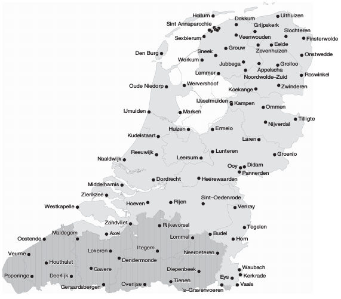
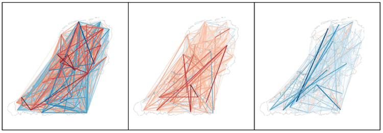
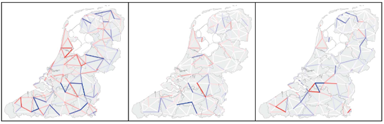

```{r setup, include=FALSE}
options(htmltools.dir.version = FALSE)
knitr::opts_chunk$set(echo = FALSE,
                      message=FALSE,
                      warning= FALSE,
                      fig.width=8.5,
                      fig.height=5)
library(lingtypology)
library(leaflet)
library(leaflet.extras)
library(leaflet.minicharts)
library(dplyr)
library(tidyr)
library(tibble)
```


## обо мне

* лингвист
* [преподаю в Школе лингвистики НИУ ВШЭ](https://www.hse.ru/org/persons/103489498)
* занимаюсь кавказскими языками, фонетикой, лингвистической статистикой и лингвистическим картографированием
* [почти все делаю в R](https://github.com/agricolamz)

> - в окружении коллег, которые все делают на Python

## #тыжлингвист мифы

* умеет читать на всех письменностях мира
* знает все языки на свете
* умеет распознавать каждый язык на слух
* может рассказать о происхождении каждого слова
* пишет без ошибок и знает все правила орфографии
* не знает математики и программирования

> - все перечисленное, конечно, не правда

## лингвистика

* прескриптивная
* вся остальная
    * исследования грамматики языка и языкового разнообразия
    * исследования распределения грамматических особенностей в языках мира
    * исследования когнитивных способностей человека и других животных, связанных с языком
    * исследования в области обработки естественного языка и его приложения
    * ...

## зачем лингвистам карты?

1. показать исследуемый язык/диалект
2. показать распределение языков/диалектов и языковых черт ([WALS](http://wals.info/feature/49A#2/16.6/148.4), и другие проекты [clld](http://clld.org/)) в пространстве и времени
3. показать отношения языковых черт в тех или иных языках/диалектах в пространстве и времени
4. показать взаимодействие языков/диалектов на основе каких-то языковых черт в пространстве и времени
5. исследовать языковые стереотипы
6. пытаться симулировать распространение языковых черт в пространстве и времени

## [`lingtypology`](https://github.com/ropensci/lingtypology)

* пакет на R
* на основе пакетов `leafletr` и `leaflet.minicharts` и базы данных [Glottolog](http://glottolog.org/)
* для
    * элементарного картографирования (`map.feature(c("Adyghe", "Russian"))`)
    * некоторых встроенных трюков для более сложной визуализации
    * API к лингвистическим базам данных
    * автоматического создания языкового атласа из простой таблички

## 1. Все жестовые языки из базы данных

```{r}
map.feature(lang.aff("Sign"),
            label = lang.aff("Sign"),
            map.orientation = "Atlantic")
```

## 1. Все адгыские селения на территории РФ

```{r}
map.feature(circassian$language,
            circassian$dialect,
            latitude = circassian$latitude,
            longitude = circassian$longitude,
            label = circassian$dialect,
            tile = "Esri.WorldStreetMap")
```

## 2. языковые признаки: категориальная переменная
```{r}
map.feature(languages = ejective_and_n_consonants$language,
            features = ejective_and_n_consonants$ejectives,
            label = ejective_and_n_consonants$language,
            title = "абруптивные звуки")
```

## 2. языковые признаки: числовая переменная
```{r}
map.feature(languages = ejective_and_n_consonants$language,
            features = ejective_and_n_consonants$consonants,
            label = ejective_and_n_consonants$language,
            title = "количество <br> согласных")
```

## 2. языковые признаки: *луна* в жестовых языках
```{r}
sign_df <- data.frame(languages = c("American Sign Language", "Russian Sign Language", "French Sign Language"),
                      popup = c("https://media.spreadthesign.com/video/mp4/13/48600.mp4", "https://media.spreadthesign.com/video/mp4/12/17639.mp4", "https://media.spreadthesign.com/video/mp4/10/17638.mp4"))

sign_df$popup <- paste("<video width='200' height='150' controls> <source src='",
                       as.character(sign_df$popup),
                       "' type='video/mp4'></video>", sep = "")

map.feature(languages = sign_df$languages, 
            popup = sign_df$popup,
            map.orientation = "Atlantic",
            zoom.level = 2)
```


## 2. языковые признаки: фигуры (для статических карт)
```{r}
map.feature(languages = ejective_and_n_consonants$language,
            features = ejective_and_n_consonants$ejectives,
            label = ejective_and_n_consonants$language,
            shape = TRUE,
            title = "ejective sounds")
```

## 2. языковые признаки: нумерация (для статических карт)
```{r}
map.feature(languages = ejective_and_n_consonants$language,
            features = ejective_and_n_consonants$language,
            label = ejective_and_n_consonants$language,
            shape = 1:19)
```

## 2. языковые признаки: время <br> Изменение во владение русским
```{r}
df <- data_frame(languages = c("Avar", "Avar", "Mehweb"),
           villages = c("Shangoda", "Obokh", "Mehweb"),
           latitude = c(42.246859, 42.28362, 42.2528),
           longitude = c(47.000153, 47.03734, 47.0472),
           `...-1919` = c(43, 25, 22),
           `1919-...` = c(85, 88, 90))
map.feature(df$languages,
            label = df$villages,
            latitude = df$latitude,
            longitude = df$longitude,
            label.hide = FALSE,
            minichart = "bar",
            minichart.data =  df[,c(5:6)],
            minichart.labels = TRUE,
            width = 8,
            tile = "Esri.WorldStreetMap",
            title = "Level of knowledge of Russian")
```
Данные собраны [Ниной Дабрушенной, и др.](https://multidagestan.com/team)

## 2. языковые признаки: время <br> Изменение во владение русским и лакским
```{r}
df %>% 
  gather(type, Russian, `...-1919`:`1919-...`) ->
  df

df$Lak <- c(96, 32, 99, 40, 3, 23)  

leaflet() %>%
  addProviderTiles("Esri.WorldStreetMap") %>% 
  addMinicharts(
    df$longitude, df$latitude, 
    chartdata = df[, c("Russian", "Lak")],
    time = df$type,
    type = "bar",
    width = 45, 
    height = 45,
    showLabels = TRUE)
```
Данные собраны [Ниной Дабрушенной, и др.](https://multidagestan.com/team)

## 2. Казалось бы проблем нет?

> * работа с растровым изображениями в R...
>     * старые карты содержат старое расселение и старые дороги (т. е. возможный языковой контакт)
> * работа с разными проекциями в R есть, но она плохо реализована в пакете `leafletr`

## 3. отношения между языковыми чертами: <br> цвет
```{r}
map.feature(circassian$language,
            features = circassian$language,
            longitude = circassian$longitude,
            latitude = circassian$latitude,
            tile = "Esri.WorldStreetMap")
```

## 3. отношения между языковыми чертами: <br> logit регрессия
```{r}
map.feature(circassian$language,
            features = circassian$language,
            longitude = circassian$longitude,
            latitude = circassian$latitude,
            line.type = "logit",
            tile = "Esri.WorldStreetMap")
```

## 3. отношения между языковыми чертами: <br> Kernal Density contourplot
```{r}
map.feature(circassian$language,
            features = circassian$language,
            longitude = circassian$longitude,
            latitude = circassian$latitude,
            density.estimation = "Circassian",
            density.longitude.width = 0.7,
            density.latitude.width = 0.7, 
            color= c("darkgreen", "blue"))
```

## 3. отношения между языковыми чертами: <br> Kernal Density contourplot
```{r}
map.feature(circassian$language,
            features = circassian$language,
            longitude = circassian$longitude,
            latitude = circassian$latitude,
            density.estimation = "Circassian",
            density.longitude.width = 0.3,
            density.latitude.width = 0.3, 
            color= c("darkgreen", "blue"))
```

## 3. отношения языковых черт: внешние полигоны
```{r}
komi <- read.csv("https://raw.githubusercontent.com/langdoc/kpv-geography/master/kpv.csv")

komi_area <- geojsonio::geojson_read("https://raw.githubusercontent.com/nikopartanen/language_maps/master/geojson/kom.geojson",
  what = "sp")

leaflet() %>% 
  addPolygons(data = komi_area, stroke = 0, opacity = .7, fillColor = "green") %>% 
map.feature(komi$language,
            komi$dialect,
            latitude = komi$latitude,
            longitude = komi$longitude,
            width = 3,
            zoom.level = 6,
            pipe.data = .)
```
Данные [Нико Партанена](https://github.com/nikopartanen/language_maps).

## 4. Отношения/взаимодействия языков  <br> @heeringa15
<center></center>

## 4. Отношения/взаимодействия языков <br> @heeringa15
<center></center>

> Convergence/divergence between dialects measured on the basis of all sound changes (left), on the basis of sound changes which cause dialects to converge to standard Dutch (center) and on the basis of sound changes which cause dialects to diverge from standard Dutch (right). Red lines indicate convergence and blue lines indicate divergence; the intensity represents the degree of convergence (red shade) or divergence (blue shade).

## 4. Отношения/взаимодействия языков <br> @heeringa15
<center></center>

> Convergence/divergence between neighboring dialects measured on the basis of all sound changes (left), on the basis of sound changes which cause dialects to converge to standard Dutch (center) and on the basis of sound changes which cause dialects to diverge from standard Dutch (right). Red lines indicate convergence and blue lines indicate divergence; the intensity represents the degree of convergence (red shade) or divergence (blue shade).

## 5. Взаимодействия языковых признаков: <br> обводка
```{r}
map.feature(circassian$language,
            features = circassian$dialect,
            stroke.features = circassian$language,
            latitude = circassian$latitude,
            longitude = circassian$longitude)
```

## 5. Взаимодействия языковых признаков: <br> изоглоссы

Карта Ю. Корякова

## 5. Взаимодействия языковых признаков: <br> изоглоссы
```{r}
map.feature(languages = circassian$language,
            latitude = circassian$latitude,
            longitude = circassian$longitude,
            features = circassian$dialect,
            label = circassian$dialect,
            legend = TRUE,
            isogloss = as.data.frame(circassian[,"dialect"]),
            isogloss.longitude.width = 1.5,
            isogloss.latitude.width = 1.5)
```

## 5. А что если признаков очень много?
>- Тогда нужна база данных, позволяющая работать со сложными запросами
>- Методы уменьшения размерностей (PCA/MCA, MDS, и др.), возможно позволят кластеризовать рассматриваемые языки/диалекты на некоторые группы

## 5. перцептивная диалектология
Видимо, началась с работ (@preston1982 and @gould86) и имеет большой инструментарий:

* Hand-drawn Map Task
* Dialect Difference Rating Task
* Dialect Classification Task
* ...

## 6. симуляция распространения языковых черт

* @abrams03
* @grieve10
* @kretzschmar14

## Cпасибо!

Г. Мороз (agricolamz@gmail.com)

Link to this presentation: [https://goo.gl/BSE6YK](https://goo.gl/BSE6YK)

## Referenses {.smaller}
